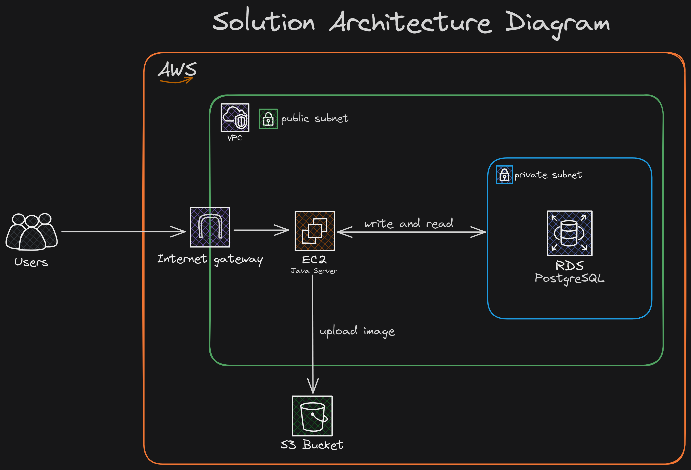

<h1 align="center" style="font-weight: bold;">
EventsHub
</h1>

<div align="center">


</div>

<p align="center">
    <a href="#started">Getting Started</a> •
    <a href="#routes">API Endpoints</a> •
    <a href="#deploy">AWS Deploy</a> • 
    <a href="#references">References</a>
</p>

<h2 id="started">About</h2>
This project is an API built using Java, Java Spring, Flyway Migrations, PostgresSQL as the database.

The API emulates the functionality of an event web application similar to [UberHub](https://app.uberhub.com.br/eventos/). Users can create and view registered events. The API has been deployed on AWS utilizing an EC2 instance, a RDS PostgreSQL database, and an S3 bucket.

<h2 id="started">Getting started</h2>

<h3>Prerequisites</h3>

- Cloning de repository

```bash
git clone https://github.com/vitorstaub/eventshub-api.git
```
- Install dependencies with Maven
- Install [PostgreSQL](https://www.postgresql.org/)
- Install [AWS CLI](https://docs.aws.amazon.com/cli/latest/userguide/getting-started-install.html)


<h3>Authentication and access credentials - AWS</h3>

- Configure the [AWS CLI](https://docs.aws.amazon.com/cli/latest/userguide/cli-chap-configure.html)

<h3>Environment Variables</h2>

application.properties
```yaml
spring.datasource.url=${AWS_DB_URL:jdbc:postgresql://localhost:5432/postgres}
spring.datasource.username=${AWS_DB_USER:vitorstaub}
spring.datasource.password=${AWS_DB_PASSWORD:password}
aws.region=us-east-1
aws.bucket.name=${BUCKET_NAME}
```

<h3>Starting</h3>
- Start the application with Maven

Accessible at
```
http://localhost:8080
```

<h2 id="routes">API Endpoints</h2>

The API provides the following endpoints:

```markdown
POST /event - Register a new event.

GET /api/event - Retrieve a list of all events.

GET /api/event/{eventId} - Retrieve a specific event by ID.
```

<h2 id="deploy">AWS Deploy</h2>

<p align="center">
    
</p>

<h3>S3 Bucket</h3>

- Create [S3 bucket](https://docs.aws.amazon.com/AmazonS3/latest/userguide/creating-bucket.html)

- Add Bucket S3 public get policy:

```json
{
    "Version": "2012-10-17",
    "Statement": [
        {
            "Sid": "PublicReadGetObject",
            "Effect": "Allow",
            "Principal": "*",
            "Action": "s3:GetObject",
            "Resource": "arn:aws:s3:::BUCKET_NAME/*"
        }
    ]
}
```

<h3>EC2 Instance</h3>

- Create [EC2 instance](https://docs.aws.amazon.com/AWSEC2/latest/UserGuide/EC2_GetStarted.html)
- Create [VPC (Virtual Private Cloud)](https://docs.aws.amazon.com/vpc/latest/userguide/what-is-amazon-vpc.html)
- Create a public subnet that uses the latter half of the IP addresses in the VPC. 

CIDR IPv4:
```
10.0.1.0/24
```
- Create a private subnet that uses the first half of the IP addresses in the VPC.


  CIDR IPv4:
```
10.0.0.0/24
```

<h3>RDS Database</h3>

- Create a [PostgreSQL Database](https://docs.aws.amazon.com/AmazonRDS/latest/UserGuide/CHAP_GettingStarted.CreatingConnecting.PostgreSQL.html)
- Add the database to the security group of the ECS instance 


<h2>Contributing</h2>

When contributing to this project, please follow the existing code style, [commit conventions](https://www.conventionalcommits.org/en/v1.0.0/), and submit your changes in a separate branch.

<h2 id="references">References</h2>

[AWS Docs](https://docs.aws.amazon.com/)

[Spring Docs](https://docs.spring.io/spring-boot/)

[Fernanda Kipper](https://www.youtube.com/watch?v=d0KaNzAMVO4)
